# 1. AWS Cloud NGFW Lab

## 1.1. Introduction

This repository and associated code is intended for a specific lab scenario for learning. Nothing here should be used for production use-cases.

## 1.2. Navigation

### 1.2.1. Outline

Session 1
- Start QL
- Create IAM Role
- Onboard Account
- Set permission on user for AWS account
- Deploy infra (isolated)
  - Includes Panorama
- Create policies in existing rulestack
  - Figure out terraform
- Publish logs/metrics to cloudwatch
- Validate traffic flows

### 1.2.2. TOC

- [1. AWS Cloud NGFW Lab](#1-aws-cloud-ngfw-lab)
  - [1.1. Introduction](#11-introduction)
  - [1.2. Navigation](#12-navigation)
    - [1.2.1. Outline](#121-outline)
    - [1.2.2. TOC](#122-toc)
- [2. Lab Session 1](#2-lab-session-1)
  - [2.1. Session 1 Topology](#21-session-1-topology)
  - [2.2. Initialize Qwiklab](#22-initialize-qwiklab)
  - [2.3. Local Execution Notes](#23-local-execution-notes)
  - [2.4. Manually Onboard Qwiklabs Account](#24-manually-onboard-qwiklabs-account)
  - [2.5. Update IAM Policies](#25-update-iam-policies)
  - [2.6. Check Marketplace Subscriptions](#26-check-marketplace-subscriptions)
  - [2.7. Setup Cloud9 IDE Environment](#27-setup-cloud9-ide-environment)
  - [2.8. Create IAM role for programmatic access](#28-create-iam-role-for-programmatic-access)
  - [2.9. Deploy AWS Infrastructure and Cloud NGFW Isolated Model](#29-deploy-aws-infrastructure-and-cloud-ngfw-isolated-model)
  - [2.10. Add permissions for your user](#210-add-permissions-for-your-user)
  - [2.11. Connect to instances](#211-connect-to-instances)
  - [2.12. Explore CloudWatch Logs](#212-explore-cloudwatch-logs)
  - [2.13. Isolated Topology Details (App1)](#213-isolated-topology-details-app1)
  - [2.14. Create Block List policy](#214-create-block-list-policy)
  - [2.15. Create Outbound Policies for App1 in Cloud NGFW Console](#215-create-outbound-policies-for-app1-in-cloud-ngfw-console)
  - [2.16. Create Inbound Policies for App1 in Cloud NGFW Console](#216-create-inbound-policies-for-app1-in-cloud-ngfw-console)
  - [2.17. Create Policies for App2 with Terraform](#217-create-policies-for-app2-with-terraform)
  - [2.18. Setup Secrets manager for outbound decryption](#218-setup-secrets-manager-for-outbound-decryption)
    - [2.18.1. Generate private key](#2181-generate-private-key)
  - [2.19. Setup Secrets manager for outbound decryption](#219-setup-secrets-manager-for-outbound-decryption)
  - [2.20. Setup Secrets manager for outbound decryption](#220-setup-secrets-manager-for-outbound-decryption)
  - [2.21. Challenge Excercise](#221-challenge-excercise)
  - [2.22. Update Cloud NGFW for Outbound Decryption](#222-update-cloud-ngfw-for-outbound-decryption)
- [3. Panoram Integration](#3-panoram-integration)
  - [3.1. Deploy Panorama](#31-deploy-panorama)
  - [3.2. Configuration](#32-configuration)
  - [3.3. Access Panorama](#33-access-panorama)
  - [3.4. Generate OTP for Device Certificate](#34-generate-otp-for-device-certificate)
  - [3.5. Add Panorama to Strata Logging Service](#35-add-panorama-to-strata-logging-service)
  - [3.6. Setup Panorama integraion](#36-setup-panorama-integraion)
  - [3.7. Panorama Plugin Setup](#37-panorama-plugin-setup)
  - [3.8. Panorama Basic Configration](#38-panorama-basic-configration)
  - [3.9. Setup Device Monitoring](#39-setup-device-monitoring)
- [4. SCM Integration](#4-scm-integration)
  - [Topology Updates](#topology-updates)


# 2. Lab Session 1

During this session you will:

- Initialize Qwiklabs (QL) environment. Each will have their own on-demand AWS account that will be active throghout the workshop
- Access existing Cloud NGFW tenant console
- Access Cloud9 AWS IDE environment
- Create IAM role for programmatic access inside QL AWS account
- Onboard QL AWS account to existing Cloud NGFW tenant
- Deploy prepared terraform to create AWS infrastructure and Cloud NGFW for "isolated model"
- Create policies through Cloud NGFW native constructs (Console and Terraform)
  
## 2.1. Session 1 Topology

For this section, we will be deploying the isolated model and managing it via the native Cloud NGFW contructs. During later sections, we will be changing to other topologies.

- Same Firewall Cluster(s) to inspect applications in multiple VPCs.
- Transparently insert inspection in your application VPCs for both Ingress and Egress Traffic.
- No TGW resource is required.
- E/W Inspection not supported for this model


## 2.2. Initialize Qwiklab

- Access [QwikLabs](https://paloaltonetworks.qwiklabs.com/) and create an account using PANW email or login with existing account
- Start Lab from the Qwiklabs Classroom. It will take a few minutes to provision
- Click Open Console and authenticate to AWS account with credentials displayed in Qwiklabs
- Check Top Right menu to verify you are in the us-west-2 (Oregon) Region

  
## 2.3. Local Execution Notes

This lab guide is designed for using the AWS Cloud9 IDE environment for git, editing files, and executing terraform. The Cloud9 environment will assume your AWS console user permissions.

If you are familiar with these tools and prefer to run locally instead of in Cloud9, you will need to need to copy the static IAM keys from QwikLabs console and use them in your local credentials. Some of the other steps throughout this guide will need to be modified if running locally.

There are various way to do this, but one example is:

```
aws configure --profile qwiklabs
AWS Access Key ID [None]: *****EXAMPLEACCESSKEY
AWS Secret Access Key [None]: ************************EXAMPLESECRETKEY
Default region name [None]: us-west-2
Default output format [None]: json
```

When executing terraform, you will need to reference profile `qwiklabs` in your tfvars that will be passed to the provider block.

## 2.4. Manually Onboard Qwiklabs Account

In this section you will need to move around between Cloud NGFW console and the AWS Console.

**There is an issue with using QwikLabs for Cloud NGFW labs. The Qwiklabs accounts are recycled after each use. Some accounts were incorrectly onboarded to a different tenant. We will onboard the account first to make sure it isn't already associated with another tenant. If you get an error when AWS account is already associated then you will have to restart Qwiklab to get a new account**

- Navigate to the [Cloud NGFW web console](https://web.aws.cloudngfw.paloaltonetworks.com/)
- Authenticate with PANW SSO
- Settings -> AWS Accounts -> Add AWS Account
- Enter Account ID -> Download Cloud Formation Template
- Create a new Cloud Formation Stack in the QwikLabs AWS account with `Upload a template file` option
- Upload the yaml file you downloaded
- Enter a name for the stack `CloudNgfwOnboarding`
- Enter TrustedAccount ID and ExternalID from Cloud NGFW Console
  - From CloudNGFW Console you can use `Check Details` on the AWS Accounts section to get the External ID and Trusted ID
- Other Parameters should remain with default values
- Deploy Stack and ensure it completes successfully

This template will create four different IAM roles that will allow Cloud NGFW service to perform actions inside the customer account.

After Stack creation is complete, we must let Cloud NGFW know the ARN of the cross-account roles that were created.
- In Cloud NGFW console, Use Actions menus on your AWS account to manage cross account roles
- The ARNs of the roles can be found on the Outputs section of the CloudFormation Stack
- Verify Status in Cloud NGFW Console goes to Success

> &#8505; It is not currently possible to modify these role ARN mappings after they are saved. You must delete and re-add the account if there is any mistake.

> &#10067; Which IAM Role(s) are required?


## 2.5. Update IAM Policies


- Search for `IAM` in top search bar (IAM is global)
- In IAM dashboard select Users -> awsstudent
- Expand `default_policy`, Edit Policy -> Visual Editor
- Find the Deny Action for `Cloud Shell` and click `Remove` on the right
- Select `Review policy`
- Select `Save changes`

---


> &#8505; Qwiklabs has an explicit Deny for CloudShell. However, we have permissions to remove this deny policy. Take a look at the other Deny statements while you are here.

> &#8505; It is important to be familiar with IAM concepts for Cloud NGFW deployments. Several features (such as bootstrap, custom metrics, cloudwatch logs, HA, VM Monitoring) require IAM permissions. You also need to consider IAM permissions in order to deploy with IaC or if using lambda for custom automation.

---

## 2.6. Check Marketplace Subscriptions

> &#8505; Before you can launch Panorama images in an account, the account must first have accepted the Marketplace License agreement for that product.

> &#8505; The QwikLabs accounts should already be subscribed to these offers, but we will need to verify and correct if required.

- Search for `AWS Marketplace Subscriptions` in top search bar
- Verify that there is an active subscription for:
  - `Palo Alto Networks Panorama`


- If you have the Panorama subscription, continue to the next section
- If you are missing either subscription, select `Discover Products` and search for `palo alto`
- Select `Palo Alto Networks Panorama` as needed
- Continue to Subscribe
- Accept Terms
- Allow a few moments for the Subscription to be processed
- Repeat for the other Subscription if needed
- Exit out of the Marketplace
- Notify lab instructor if you have any issues

---

## 2.7. Setup Cloud9 IDE Environment

- Copy Cloud9 URL from QwikLabs
  - Alternatively, search for Cloud9 in AWS Console
- Once inside the environment, we need to adjust a setting for IAM to work
  - Cloud9 Icon in top left -> Preferences
  - AWS Settings
  - Disable `AWS managed temporary credentials`
---

- Run below command from Cloud9 terminal. It will:
  - Clone the repository that contains the code and resources for this lab
  - Execute a shell script to install terraform in the Cloud9 envitonment


```
cd ~/environment && git clone https://github.com/seanyoungberg/terraform-aws-swfw-modules.git && chmod +x ~/environment/terraform-aws-swfw-modules/deployments/install_terraform.sh && ~/environment/terraform-aws-swfw-modules/deployments/install_terraform.sh
```


> &#8505; Terraform projects often have version constraints in the code to protect against potentially breaking syntax changes when new version is released. For this project, the [version constraint](https://github.com/PaloAltoNetworks/lab-aws-gwlb-vmseries/blob/main/terraform/vmseries/versions.tf) is:
> ```
> terraform {
>  required_version = ">= 1.3.0, < 2.0.0"
>}
>```
>
>Terraform is distributed as a single binary so isn't usually managed by OS package managers. It simply needs to be downloaded and put into a system `$PATH` location. In this case ~/bin/terraform.

---

## 2.8. Create IAM role for programmatic access

Before we can deploy Cloud NGFW resources with Terraform, we must first create a role in AWS.

You will authenticate against your Cloud NGFW by assuming roles in your AWS account that are allowed to make API calls to the AWS API Gateway service. The associated tags with the roles dictate the type of Cloud NGFW programmatic access granted — Firewall Admin, RuleStack Admin, or Global Rulestack Admin.

- Execute terraform to create IAM role

```
cd ~/environment/terraform-aws-swfw-modules/deployments/iam_roles_cloudngfw/

cp example.tfvars terraform.tfvars

terraform init

terraform apply
```

- View the IAM Role in Console

> &#10067; What is the purpose of this role?

> &#10067; Who can assume this role?

> &#10067; What do the tags allow?
 

## 2.9. Deploy AWS Infrastructure and Cloud NGFW Isolated Model

During this step, you will deploy a prepared terraform package based on the public module example. It will create the AWS infrastructure as well as utilize the CloudNGFW provider to deploy a Cloud NGFW resource and basic local rulestack.

The initial deployment will be isolated model, where GWLB endpoints are created in each application VPC. All inbound and outboud Internet traffic is directed to endpoints inside the application VPC.

- Same Firewall Cluster(s) to inspect applications in multiple VPCs.
- Transparently insert inspection in your application VPCs for both Ingress and Egress Traffic.
- No TGW resource is required.
- E/W Inspection not supported for this model


```
cd ~/environment/terraform-aws-swfw-modules/deployments/ql_cloudngfw_isolated_design/

cp example.tfvars terraform.tfvars
```

We will all be sharing the same Cloud NGFW tenant, so need to set a unique name to identify your resources.

- Edit value of `name_prefix` in `terraform.tfvars` to your name or a unique identifier
- **Use a short name (less than 8 characters) for `name_prefix`. You will have issues creating some resources if the name is too long.**
- **Make sure to save the change if you edit in the Cloud9 IDE.**

- All other values can stay the same for now
- Deploy infrastructure

```
terraform init
terraform apply
```

Deployment will take around 5 minutes and then another 15 minutes before Cloud NGFW resource is ready.

## 2.10. Add permissions for your user

CloudNGFW creates separate roles for each AWS account. Even if a user has tenant admin, you still must add specific roles to have permissions for RuleStacks and Firewalls per account.

- In Cloud NGFW Console
- Settings -> Users and Roles
- Edit your user to add LocalFirewallAdmin and LocalRuleStackAdmin for your Qwiklabs AWS account

This must be done for any users that need to manage FW or rulestacks for an account. It is a commonly missed issue and can cause confustion for why users aren't able to do expected tasks in the console.


## 2.11. Connect to instances

The deployment should have taken care of everything needed for initial traffic flows to work for the simple HTTP apps. Validate that you can access your web servers via the ALB DNS name (using HTTP/80).

Validate you can use session manager to connect to the shell of your app servers.


## 2.12. Explore CloudWatch Logs

With the deafult experience, Cloud NGFW takes advantage of AWS Native services. Logging can be configured for CloudWatch, S3, or Kinesis. CloudWatch is the most common and typically more familiar.

- Check the Log Settings for your Cloud NGFW
- Go to CloudWatch Console in AWS and select one of the Traffic Logs
- Expand to see the formate of the message and the fields that are being logged

You can browse through each CloudWatch log stream, but this isn't a very powerful or useful way to find data. Let's make some queries and a dashboard to see how to get more relevant information.

- Go to Cloud Watch log insights
- Select the `PaloAltoCloudNGFW` Log Group

Here is an example of a simple query to identify traffic based on IP:

```
filter @logStream like /.*TRAFFIC.*/ 
| filter src_ip = "10.104.0.161"
```

- Create and Run a query to identify the top 20 inbound source IPs

```
filter @logStream like /.*TRAFFIC.*/ 
| fields @message 
| stats count(*) as sources by src_ip 
| sort sources desc 
| limit 20
```

Experiment with the query generator to help refine your filters using natural language

- In query generator prompt, try something like: "Exclude any private source IPs" and select `Update query`
- If everything looks right. Save the query. Create a new folder to store your queries

Let's make a dashboard that we can add the queries to. We will continue to add to this dashboard throughout the lab.

- CloudWatch -> Dashboards -> Create Dashboard -> Name `CloudNGFW`
- Add widget type Data Type: `Logs` and Widget type: `Logs Table`
- Select your saved query
- Make sure to save your Dashboard

Follow the same process to create some additional saved queries and widgets

- Top 10 Inbound source countries (bar chart)
- Top 10 Outbound App IDs
- Logs with no bytes received

> &#10067; How many different Traffic log streams are there? What do these separate streams represent?

## 2.13. Isolated Topology Details (App1)
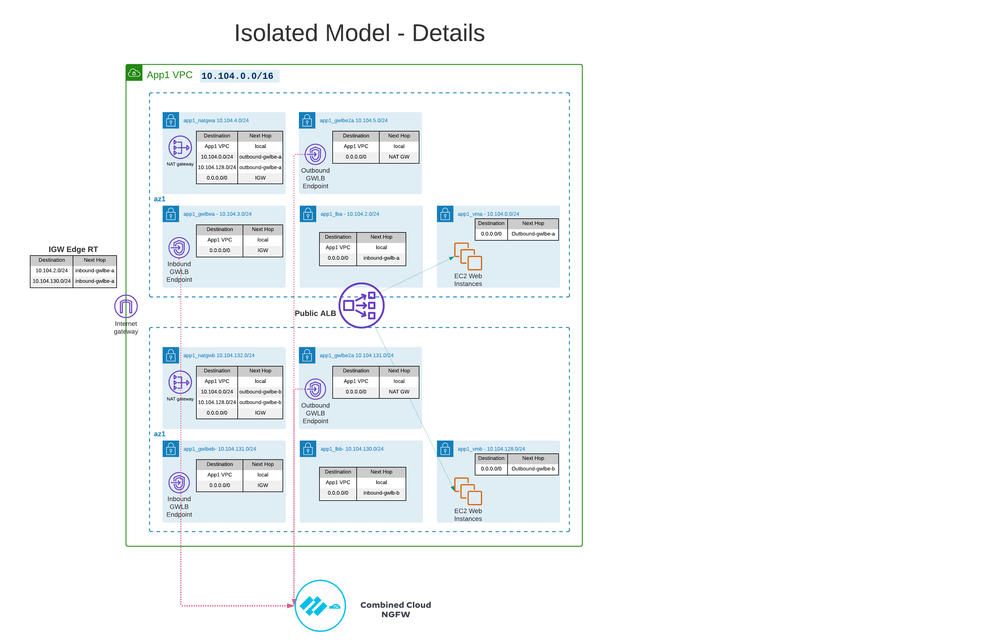

## 2.14. Create Block List policy

When working in the Cloud NGFW console, you will need to select the appropriate region. Similar to AWS console. For this lab, you will use Oregon (us-west-2)

In your rulestack, create a common policy to block traffic from PANW Feeds

- Priority: 1
- Source: 
  - Feeds: All built-in PANW threat Feeds
- All other can be left as `Any`
- Make sure to enable logging


## 2.15. Create Outbound Policies for App1 in Cloud NGFW Console

For now we will create a generic policy so we can use logs to see what kind of outbound policies we will need. We will only target App1 VPC for now.

- Create prefix lists for App1-vma and App1-vmb subnets
- Create App1 Outbound policy
  - Priority: 5
  - Source: App1 VM subnet prefix lists
  - Make sure to enable logging

## 2.16. Create Inbound Policies for App1 in Cloud NGFW Console

Create inbound prefix list and rules for App1.

- Create prefix lists for App1-lb-a and App1-lb-b subnets
- Create App1 Inbound policy
  - Priority: 10
  - Source: Any
  - Destination: App1 LB subnet prefix lists
  - Make sure to enable logging

## 2.17. Create Policies for App2 with Terraform

Now, we will create the same outbound and inbound rules for App2 using Terraform. This will utilize the Cloud NGFW provider.

Reference the [provider docs](https://registry.terraform.io/providers/PaloAltoNetworks/cloudngfwaws/latest/docs) to create the same objects and policies that were created in the console for App1.

There is an existing starting template `rules.tf.no` in the deployment directory. Rename this to `rules.tf` and in subsequent terraform operations it will be parsed.

You will need to modify it and reference the provider documentation to figure out how to create all of the required resources. Make sure to set a priority for the rules that doesn't overlap with existing rules.

## 2.18. Setup Secrets manager for outbound decryption

Decryption is critical to be able to bring full value from Cloud NGFW inspection but it comes with many challenges. In this section, we will test setting up the native integration with AWS Secrets Manager to store CA Certs.

- From Cloud9 Environment, make sure you have the latest code updates

```
cd ~/environment/terraform-aws-swfw-modules/deployments/ql_cloudngfw_isolated_design 
git pull
```

### 2.18.1. Generate private key

- Use Cloud9 Environment to generate CA private key 

```
openssl genrsa -out cngfwCA-untrust-private-key.pem 2048
```

- Use the same key to create a certificate

```
openssl req -x509 -sha256 -new -nodes -key cngfwCA.pem -days 3650 -out cngfwCACert-untrust-public-key.pem
```

You can leave fields as default / blank

- Use AWS CLI to creat a secret containing only the public key

This will be used by other client systems to be able to retreive the public key and add it to the trust store.

```
aws secretsmanager create-secret --name cngfw-public-key --secret-string file://cngfwCACert-untrust-public-key.pem
```

- Use AWS Console to create the secret used by Cloud NGFW

The secret must be in a specific format for Cloud NGFW to consume it as described in the [TechDocs](https://docs.paloaltonetworks.com/cloud-ngfw/aws/cloud-ngfw-on-aws/rules-and-rulestacks/cloud-ngfw-security-rule-objects/add-a-certificate-to-cloud-ngfw-for-aws).

- Open up secret manager under AWS to store new secret
  - Other type of secret > enter private key and certificate created

- Give it a name `cloudngfwca-untrust`
- IMPORTANT: The secret must be tagged to allow Cloud NGFW service to retrieve it
  - Key: PaloAltoCloudNGFW
  - Value: true

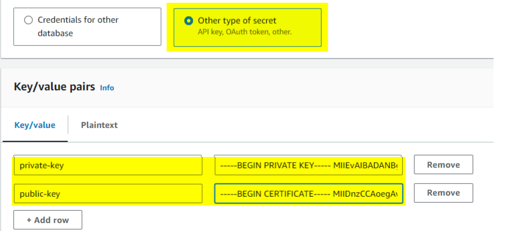


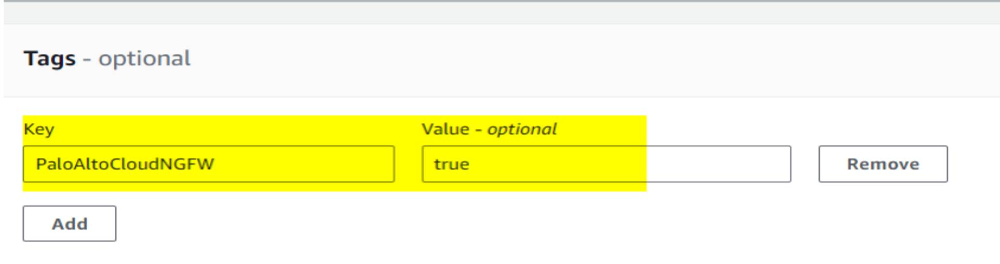

- Update IAM roles to allow spoke instances to interact with secrets manager

Changes for this were prepped in the terraform. We will provide additional policy to the Spoke IAM instance profile

## 2.19. Setup Secrets manager for outbound decryption


```
cd ~/environment/terraform-aws-swfw-modules/deployments/ql_cloudngfw_isolated_design 
terraform apply
```

## 2.20. Setup Secrets manager for outbound decryption

- Install CA Certs on app1_vm01 and app1_vm02

We need to setup the CA Trust store before enabling decryption on the Cloud NGFW since we will be using TLS based commands to retrieve the CA.

Simply adding it to the OS Cert store seems to be enough for some common services. However, many applications and libraries maintain their own CA Trust, so care should be taken when enabling decryption.

Connect via Systems Manager to app1_vm01 and app1_vm02

```
aws secretsmanager get-secret-value --secret-id cngfw-public-key --query SecretString --region us-west-2 --output text > /tmp/cloudngfw_ca.pem

sudo mv /tmp/cloudngfw_ca.pem /etc/pki/ca-trust/source/anchors/

sudo update-ca-trust
```

- Verify Cert
```
openssl verify /etc/pki/ca-trust/source/anchors/cloudngfw_ca.pem
/etc/pki/ca-trust/source/anchors/cloudngfw_ca.pem: OK
```

##  2.21. Challenge Excercise

As a challenge, try to use AWS Systems Manager to deploy the CA Cert from Secrets Manager to the App2 VMs.


##  2.22. Update Cloud NGFW for Outbound Decryption

- Create Certificate Profile

In Cloud NGFW Profile:

Rulestack -> Objects -> Certicates
Do NOT check "Self Signed Certificate"

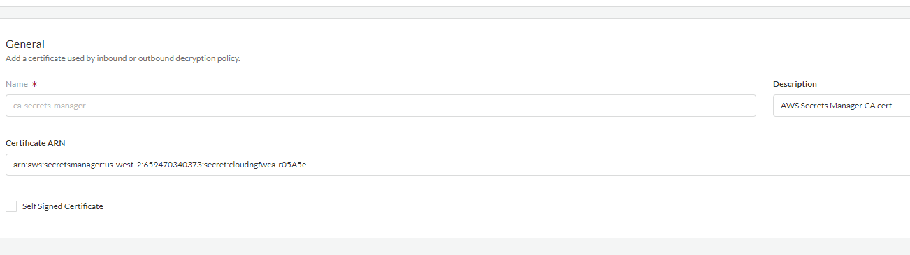

- Update App1 Security Policy to TLS Decryption

If you are using Terraform, you can this under profile_config

```
    profile_config = {
      anti_spyware  = "BestPractice"
      anti_virus    = "BestPractice"
      vulnerability = "BestPractice"
      file_blocking = "BestPractice"
      url_filtering = "BestPractice"
      outbound_trust_certificate = "ca-secrets-manager"
      outbound_untrust_certificate = "ca-secrets-manager"
    }
```

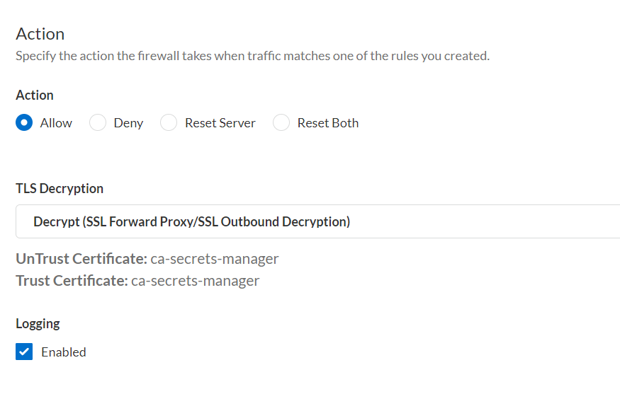

- Generate some traffic to verify TLS services are still working

```
sudo yum install git

aws sts get-caller-identity

curl -v https://ifconfig.me
```

In the curl output you should see issuer details matching the CA cert you generated. 

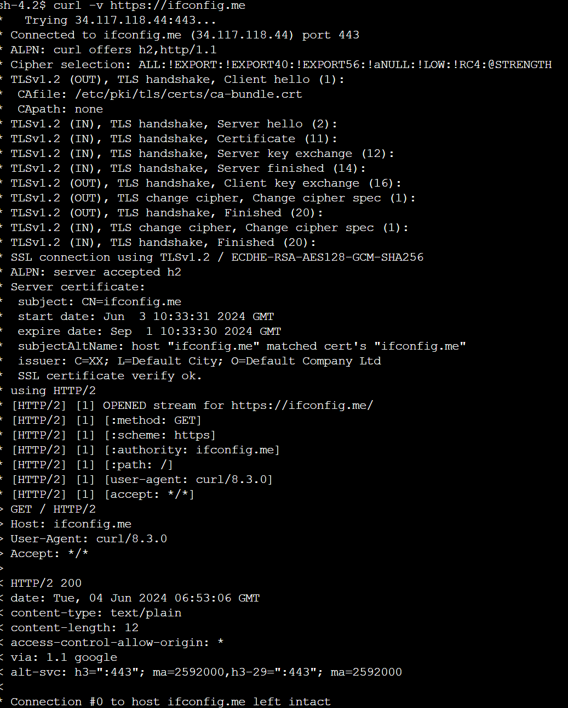

# 3. Panoram Integration

## 3.1. Deploy Panorama

We will deploy a new Panorama in a separate management VPC. We will deploy in a separate region `us-west-1` to get around the Qwiklabs limits on CPUs per region.

We will have to deploy an entirely fresh Panorama. There are issues connect to CDL with a Panorama cloned from a disk image.

```
cd ~/environment/terraform-aws-swfw-modules/deployments/panorama_standalone

cp example.tfvars terraform.tfvars
```

- Update terraform.tfvars to reference your client source IP for use in the AWS Security groups that allow inbound access to Panorama

```
          https = {
            description = "Permit HTTPS"
            type        = "ingress", from_port = "443", to_port = "443", protocol = "tcp"
            cidr_blocks = ["130.41.210.143/32"] # TODO: update here
          }
          ssh = {
            description = "Permit SSH"
            type        = "ingress", from_port = "22", to_port = "22", protocol = "tcp"
            cidr_blocks = ["130.41.210.143/32"] # TODO: update here
          }
```

- Deploy infrastructure

```
terraform init

terraform apply
```

## 3.2. Configuration

- Get public IP for each Panorama instance(s): `terraform output panorama_public_ips`
- Download the SSH Key from the QwikLabs console (pem or ppk)
- For pem you will likely need to change the permissions
  - `chmod 400 qiwkLABS-xxxxxxx.pem`
- Connect to the Panorama instance(s) via SSH using your associated private key: `ssh admin@x.x.x.x -i /PATH/TO/YOUR/KEY/qiwkLABS-xxxxxxx.pem`
- Set `admin` password:

```
> configure
# set mgt-config users admin password
```

## 3.3. Access Panorama

Use a web browser to access https://x.x.x.x and login with admin and your previously configured password

We will need to use a unique Serial Number since all will be associated with the same Hub Tenant and Cloud NGFW Tenant.

- Set Serial Number and Hostname
- Retrieve Licenses
- Install Dyanmic Updates (App & Antivirus)
- Set DNS and NTP

 to retrieve Device Certificate for Panorama


## 3.5. Add Panorama to Strata Logging Service

- Access SLS through the Hub and access [TSG 1529801457](https://logging-service.apps.paloaltonetworks.com/dashboard?instance=QP5rGlV5JDheGLpL0alPcrW1pBXWVMHol4yyeppxTWmkM5oOl3hQyeGw2OBX&tsg_id=1529801457)

- Follow the [TechDocs](https://docs.paloaltonetworks.com/strata-logging-service/administration/planning/deploy-with-panorama/configure-panorama#configure-later) starting on Step 4 to:
  - Associate Panorama with SLS
  - Retreive SLS license
  - Install Cloud Services plugin latest (5.0.0-h33)
  - Generate OTP for Plugin / SLS

- Reboot Panorama if it still doesn't connect to SLS

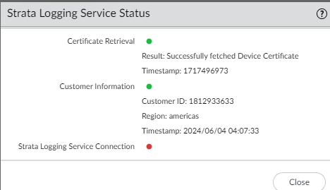

## 3.6. Setup Panorama integraion

[TechDocs Link](https://docs.paloaltonetworks.com/cloud-ngfw/aws/cloud-ngfw-on-aws/panorama-integration-overview/cloud-ngfw-aws-panorama-integration/associate-a-linked-panorama-to-the-cloud-ngfw-resource)

- From Cloud NGFW Console
- Integrations -> Add Policy Manager
- Select your Panorama and confirm the integration
- Locate your NGFW in the Cloud NGFW console
- Select the Firewall Settings tab
- In the Policy Management Section change Rulestack to "None"
- After saving, you can no change the policy management to Panorama and select your linked Panorama

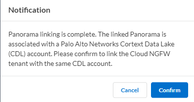

## 3.7. Panorama Plugin Setup

- Review the [prerequistes for Panorama Integration](https://docs.paloaltonetworks.com/cloud-ngfw/aws/cloud-ngfw-on-aws/panorama-integration-overview/cloud-ngfw-aws-panorama-integration/prepare-for-panorama-integration)

- Install latest AWS Plugin on Panorama

- After installation, run following CLI command on Panroama

```
request plugins cloudconnector enable cloudngfw
```

- From Panorama AWS Plugin Menus:

- Check Panorama -> Cloud NGFW -> Resources and verify it is retreiving Cloud NGFW tenant info.

- Create a Cloud Device Group
  - Use the inline menu to create a new template stack
  - Name the DG something unique, as this will be displayed in the Cloud NGFW console

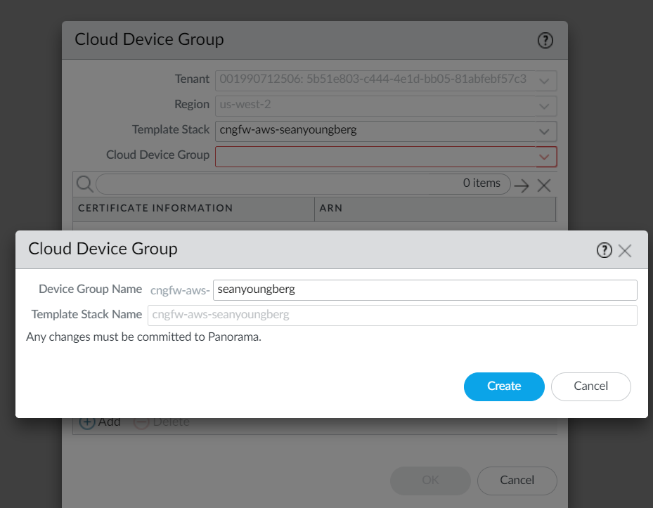

**Note I ran into a bug here and couldn't commit after creating Cloud Device Group. Please speak up if you have the same issue**

- Commit to Panorama

- Push to Cloud NGFW
  - You will need to manually select the Push Scope

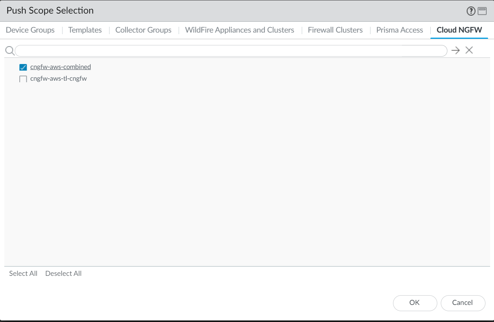


## 3.8. Panorama Basic Configration

- Log forwarding profile `default`
- Security Profile group `default`
- Create policy for outbound traffic

## 3.9. Setup Device Monitoring


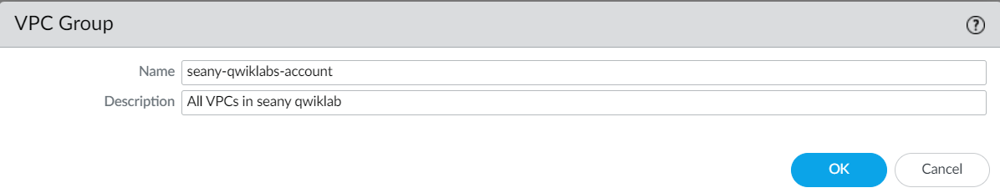

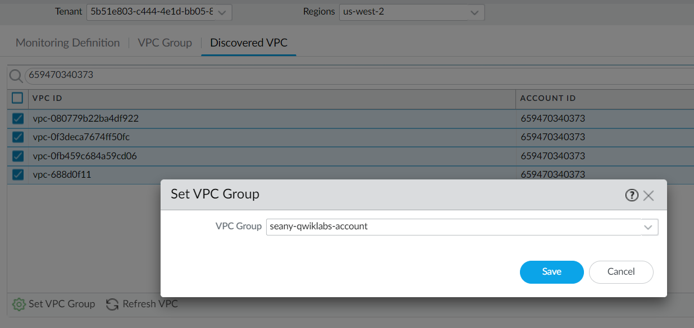

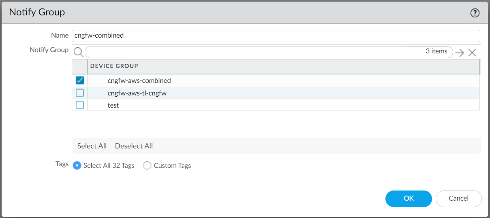

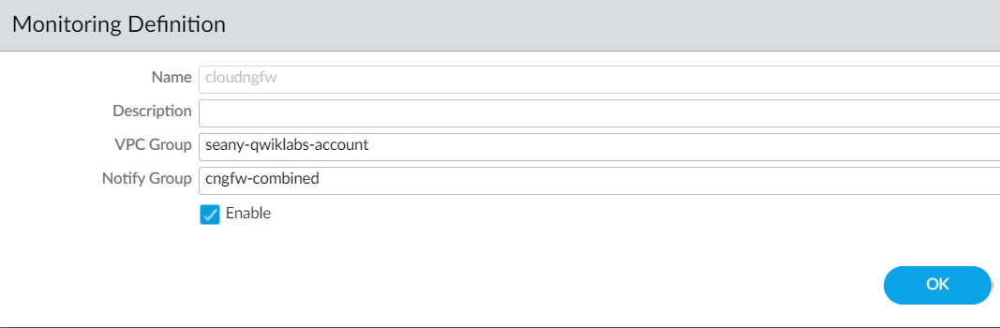


# 4. SCM Integration

SCM Integration was recently launched for GA!

Reference the instructions from the [NPI Deck](https://docs.google.com/presentation/d/1Dn8AluVmJdulxH4sG5SPSSXAEWNrVYFsFt9T0Ussh8U/edit#slide=id.g6e50fccc39_0_1) and [TechDocs](https://docs.paloaltonetworks.com/cloud-ngfw/aws/cloud-ngfw-on-aws/strata-cloud-manager-policy-management) to expirement with the soltuion

The Cloud NGFW console should display any TSGs that you have access to. However, there is an issue with the linking between the CSP and our TSG in our environment.

Instead we will use my SE Lab TSG. Note you can also use any other TSG that you have access to which has SCM Firewall Management enabled.

- If you have another tenant with SCM access. Create a new link in Cloud NGFW console to it
- Otherwise, inspect the existing Integration link to "Sean Youngberg - SE Lab - Prisma Access"
- Use the Cloud NGFW Console to create a new NGFW resource in the `us-west-2` region
- [Open SCM](https://apps.paloaltonetworks.com/hub?tsg_id=1561638640) for TSG 1561638640
- Create a new folder and associate your Cloug NGFW
- Create objects and policies to prepare for outbound and east/west traffic from App1 and App2 environments

## Topology Updates

You can run terraform to update to a recommended OBEW model and direct traffic to your SCM-managed Cloud NGFW.

```
git pull

cd ~/environment/terraform-aws-swfw-modules/deployments/ql_cloudngfw_isolated_design

mv terraform.tfvars terraform.tfvars.backup

cp example.tfvars terraform.tfvars
```

Edit terraform.tfvars

Line2 : Edit `name_prefix`. Use the same name you did for the initial deployment!
Line 564: Edit the Service Name for the Cloud NGFW GWLB service (found in Cloud NGFW console)

```
  cngfw_obew = {
    name            = "cngfw_obew"
    vpc             = "security_vpc"
    vpc_subnet      = "security_vpc-gwlbe_outbound"
    act_as_next_hop = false
    to_vpc_subnets  = null
    delay           = 0
    service_arn     = "com.amazonaws.vpce.us-west-2.vpce-svc-0c149074b9832e012"
  }
```

Apply terraform

```
terraform init

terraform apply
```